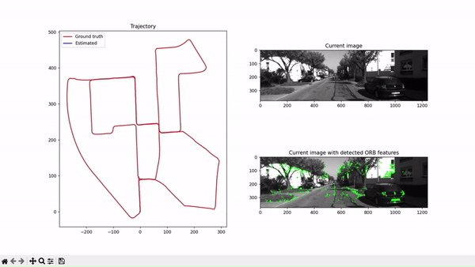
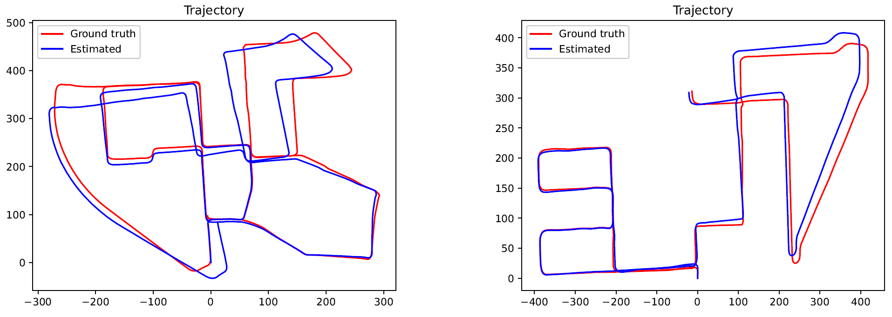

# Monocular Visual Odometry
Monocular visual odometry using ORB implemented in Python with OpenCV

  
 Sped up demonstration on the 00 KITTI sequence

This application/project was developed as a part of the graduate elective course "Robot Vision", which is part of the Automatic control and electronics Master's degree program offered by the Faculty of Electrical Engineering, University of Sarajevo.

The goal of the project was to implement a simple monocular visual odometry system using ORB. Implementation is done in Python and uses the [OpenCV](https://github.com/opencv/opencv) library. The [KITTI](https://www.cvlibs.net/datasets/kitti/eval_odometry.php) dataset was used for testing. The code contains implementations of motion estimation from both 2D-2D and 3D-2D correspondences, although only 2D-2D gives good results. Relative scale estimation for the 2D-2D case is also implemented but it is not very reliable. The implementation gives very good results when using 2D-2D correspondences and taking scale information from the KITTI ground truth poses.

  
 Results for KITTI sequences 00 and 08

Project done by:
- [Dženan Kreho](https://github.com/dkreho1)
